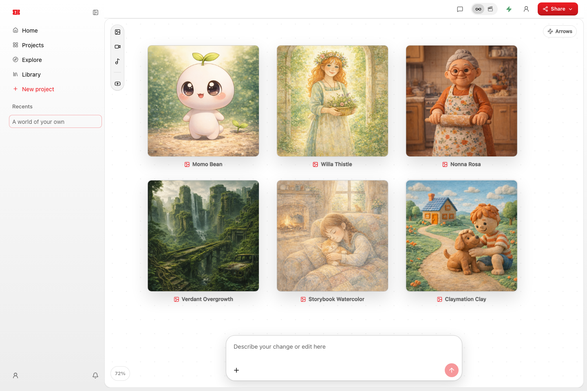
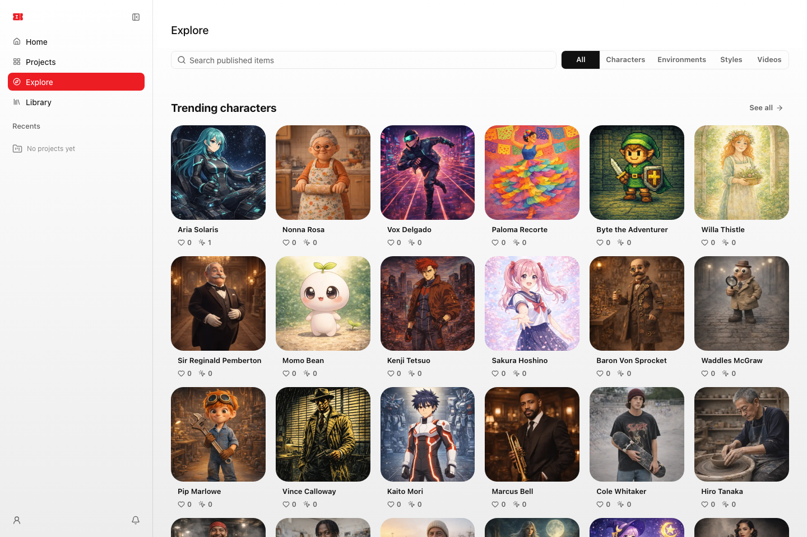
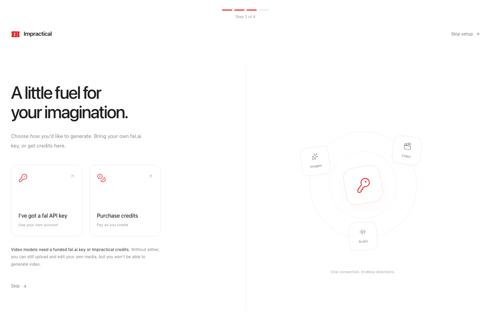

<p align="center">
  
</p>

<h1 align="center">Impractical</h1>

<p align="center">An open-source canvas for creating, editing, and shipping AI video projects.</p>

<p align="center">
  <a href="https://github.com/Openpod/impractical-video/actions/workflows/ci.yml"></a>
</p>

<p align="center">
  <a href="docs/images/canvas.png"></a>
  <a href="docs/images/explore.png"></a>
  <a href="docs/images/onboarding.png"></a>
</p>

Arrange ideas on an infinite canvas, edit on the timeline, and work with Claude
Code or Codex. Bring your own fal.ai key. Your projects stay as ordinary files
on your machine.

**Public alpha · Apache 2.0.** Free to use, modify, and distribute, including
commercially, under the [Apache License 2.0](LICENSE). Bundled third-party code
retains its own licenses; see [THIRD_PARTY_NOTICES.md](THIRD_PARTY_NOTICES.md).

The first release is aimed at developers and early adopters running from source.
It includes onboarding, local assets, agent tools, and a timeline editor. Paid
provider generation, hosted checkout, and Windows desktop behavior have not been
validated end to end for this release. Signed desktop installers are not included.
See [validation and limitations](docs/release-validation.md).

## Quickstart

Requirements: **Node.js 22.13+**, npm, and Git. macOS is the primary desktop
platform; the local web app can also run on Linux. Windows is not yet verified.

```bash
git clone https://github.com/Openpod/impractical-video.git
cd impractical-video
npm ci
npm run setup
npm run doctor
npm run dev
```

Open **http://localhost:3000**. Setup creates a private `.env.local`, enables
local mode, and generates an MCP credential. It preserves an existing env file.
No Trigger.dev, Clerk, Supabase, Stripe, or Impractical account is needed.

For the desktop app, stop the web dev server and run:

```bash
npm run desktop:dev
```

Desktop opens its own loopback server and configures agent integration when
you open a project. See [desktop/README.md](desktop/README.md).

On first launch, a four-step setup introduces the workspace, checks Claude Code
and Codex, lets you choose a fal.ai key or Impractical credits, and creates your
first project. Every step can be skipped. Reopen it from **Account → Setup guide**.
Without a funded key or credits, you can upload and edit your own media;
video generation stays unavailable.
Your first project includes a short tour of the canvas, editor, and chat controls.
Skip it whenever you like or replay it from **Account → Project tour**.

Use **Library → Upload files** or drag files into Library to keep images, videos,
audio, documents, and other assets ready for your projects (up to 100 MB per file).
Uploads work without an account or API key and stay on your device. Open an asset
to preview or download it, then choose **Use** to copy it into a project. Rename
or remove uploads from their action menu; removing a Library upload leaves any
copies already added to projects intact.

## Optional capabilities

| Capability | What you need |
| --- | --- |
| Canvas, uploads, local persistence, timeline editing | No provider credentials |
| Agent prompts and selection-aware tools | Claude Code or Codex installed and signed in |
| Image, video, speech, music generation | Your own fal.ai key, or Impractical credits in Desktop; charges apply |
| Frame extraction, trimming, media processing | `ffmpeg` and `ffprobe` on PATH |
| Explore character examples, environments, styles, and videos | Internet access; the public Impractical catalog needs no account or API key |
| Hosted accounts, billing and shared catalogs | A separately configured hosted deployment |

Install FFmpeg with `brew install ffmpeg` on macOS or `sudo apt install ffmpeg`
on Debian/Ubuntu. Restart the app after changing environment variables.
Generation is not offline; prompts and selected media are sent to the provider
when you request generation. Purchasing Impractical credits explicitly connects
Desktop to the hosted account, checkout and generation service.

## Use your own fal.ai key

1. [Create a fal.ai key](https://fal.ai/dashboard/keys) with **API** scope.
2. Open Impractical, click the **Account** icon, then **API keys**.
3. Paste the complete key and click **Save key**. New generations and uploads
   use it immediately, including in the packaged desktop app.

You can replace or remove the saved key from the same dialog. Saving is free;
the key is checked by fal.ai when you generate. Generation charges go directly
to your fal.ai account, which needs sufficient balance and model access.
Editing and uploading files into a local project need no key.

As an alternative, set `FAL_KEY` in `.env.local` and restart the app. A key saved
in the app takes priority; removing it restores the environment key. Hosted
deployments use server environment credentials. Local API settings remain
available when desktop cloud mode is enabled; saving a key selects fal.ai billing.

Keys are stored outside projects in a private local settings file and never
returned by the settings API. See [key storage and troubleshooting](docs/local-development.md#api-key-storage).

To use Impractical credits instead, open **Account → Setup guide → Generation &
billing → Purchase credits** in Desktop. Sign in and choose a one-time pack in
the existing Impractical checkout. Setup checks the actual account balance after
payment. The local browser workspace supports BYOK; hosted credit sign-in
requires Desktop. Neither opening checkout nor saving a key makes a charge.

## Connect your agent

The desktop app automatically sets up both supported agents. For browser mode,
create a project, copy the ID from `/projects/<id>`, then run:

```bash
npm run paper:setup -- <project-id>
cd data/projects/<project-id>
claude
# or: codex
```

Approve the CLI's project trust/MCP/hook prompts, keep the project open, select
an item, and wait for the app to acknowledge the selection before prompting.
Agent configuration is project-scoped and contains no API keys or bearer tokens.
Existing agent files are preserved; conflicts are explained in the project's
`.video-fs/CONNECT_AGENTS.md`. In browser mode, run setup before using the
project’s agent prompt box.

## Project files

Development projects live in `data/projects/<project-id>/`. Set an absolute
`VIDEO_FS_DATA_ROOT` to use another directory. Packaged desktop projects live
under Electron's application-support directory (on macOS,
`~/Library/Application Support/Video FS/projects/`). Deleting a project moves
it into `trash/projects/` beside the projects directory.

Reference records, scene descriptions, keyframes, clips and operation history
are Markdown with JSON frontmatter. Media lives alongside those records. Back
up the entire project directory, including hidden metadata; the editor also
uses browser storage, so preserve the desktop/browser profile for editor state.

## Development and verification

```bash
npm run check                  # lint, types, unit/integration and desktop tests
npx playwright install chromium
npm run test:smoke             # projects, editor, API-key setup; no paid APIs
npm run build
npm start                     # local production server on localhost:3000
npm run release:scan
npm run release:source        # clean source snapshot in dist/source/video-fs
```

Use `npm ci` for reproducible installs. See [CONTRIBUTING.md](CONTRIBUTING.md),
[local development](docs/local-development.md), [security](SECURITY.md), and
[release instructions](docs/releasing.md).

## Current limits

- Local mode is a trusted, single-user workspace. Keep it on loopback.
- Agent and generation features require the corresponding CLI/provider setup.
- Local background jobs run in the app process. Keep the app running until
  they finish; they do not automatically resume after an app restart.
- Hosted billing, shared catalogs, and remote tracking are optional services.
- Granular editor command coverage, cross-actor undo, and crash recovery remain
  incomplete. Keep backups of valuable projects.
- No automatic desktop updater is configured. Public macOS binaries require
  Developer ID signing and notarization; unsigned builds are for local testing.

Paid-provider execution and signed desktop delivery need their own release
validation; the credential-free test suite does not exercise those services.
